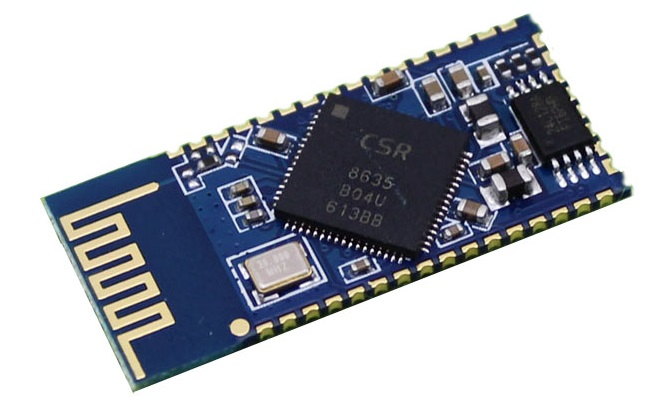

# NovaBox

This is a circuit and PCB design for a Bluetooth stereo amplifier

### Why build yet another Bluetooth speaker?

The main motivation for this project was the fact that I needed a Bluetooth speaker with batteries that are easy to remove and replace. Most of the commercial Bluetooth speakers have a charging port, and when you run out of battery power the device has to be connected to a charger for several hours. With removable batteries it takes 10 seconds to go from empty to full and you don't need an integrated charger. Even though CSR8635 needs only a few components to be able to charge Li-ion batteries, an integrated charger would make the PCB larger, there would be problems with heat dissipation during charging, and charging a medium capacity 18650 battery would take too long.

## The circuit

The circuit is based around the CSR8635 module you can get on most Chinese on-line shops. Its model number is BT835.

### Schematic and PCB

The circuit and PCB are designed in KiCad v5. The project contains all the symbols in its own symbol library (NovaBox.lib) and all the footprints (NovaBox.pretty). The schematic only references power symbols (GND, VCC, Batt, 5V) from the KiCad libraries. The circuit schematic is also saved in PDF [here](docs/NovaBox_8635.pdf).

The PCB has two layers with components soldered on both sides.

### Circuit sections

The circuit has several subsections:

* A single unprotected Li-ion 18650 battery with reverse protection and reverse indicator LED, and a hard on/off switch brought out to a pin header.
* The CSR8635 module with four buttons brought out to pin headers, an RGD LED driven from the module's 3 LED pins, and CSR8635's USB pins brought out to a THT Mini USB connector. The buttons can be configured for any of the standard commands: play/pause, next, volume up/down and so on.
* A section providing a pulse on CSR8635's PWER_E pin which wakes it up after the circuit has received power.
* The power section with an [LT1308](docs/LT1308abfb.pdf) DC/DC converter which boost the battery voltage to 5V. The power section is disabled when CSR8635 goes to shutdown on low battery (< 3.2V). The power section can supply up to 1A or 5W. LT1308 has a soft-start feature which is implemented in the design, but is not necessary for the operation of the rest of the power section.
* A four level battery charge indicator with four LEDs which is built around a quad op-amp [MCP6004](docs/MCP6004.pdf). The op-amps work as comparators with inputs from four voltage dividers, comparing them to a 2.5V reference [LM4040](docs/lm4040-n.pdf). The op-amp outputs drive the four LEDs.
* The audio amplifier section is built around two [PAM8304](docs/PAM8304.pdf). The amplifiers can drive two 8Ω speakers at 1.7W each. They can also drive 4Ω speakers at 3W each, but the sum power requirement of the amplifiers would exceed the 5W that LT1308 can provide.
 
## Flash configuration

The SPI configuration interface of the CSR8635 module is brought out to a 5 pin header. This can be used to configure various parameters of the system such as device name, button mapping, RGB LED states, etc.
