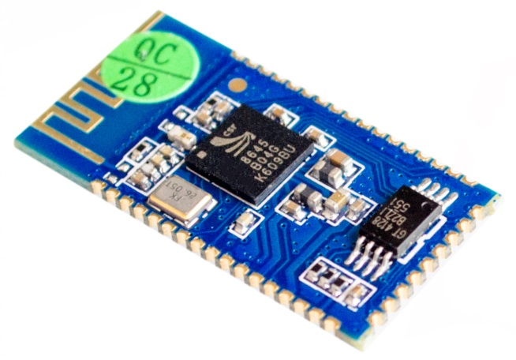
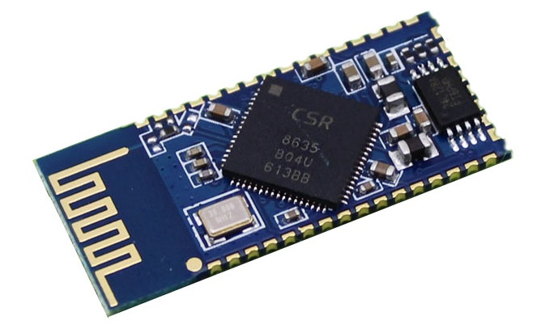

# NovaBox
Circuit and PCB design of simple Bluetooth stereo received and amplifier

### CSR8645 based circuit

This version is based around the CSR8645 module you can get on most chinese online shops. The output from the module is amplified using a pair of PAM8304 (one for each channel).

The circuit is powered from a single unprotected Li-ion 18650 battery. The circuit has over-discharge protection from with the DW01 IC.

I have decided not to include a battery charger, even though CSR8645 needs only a few simple components to be able to charge Li-ion batteries. An integrated charger would make the PCB too large, there would problems with heat during charging, and charging a medium capacity 18650 battery would take too long (over 7 hours).

The circuit includes a 4 level battery state indicator.

The CSR8645 configuration SPI inteface is brought out to a 5 pin connector.

The circuit and PCB are designed using KiCad.

### CSR8635 based circuit

A slightly simpler version of the circuit is based around CSR8635. This one is still in early development.